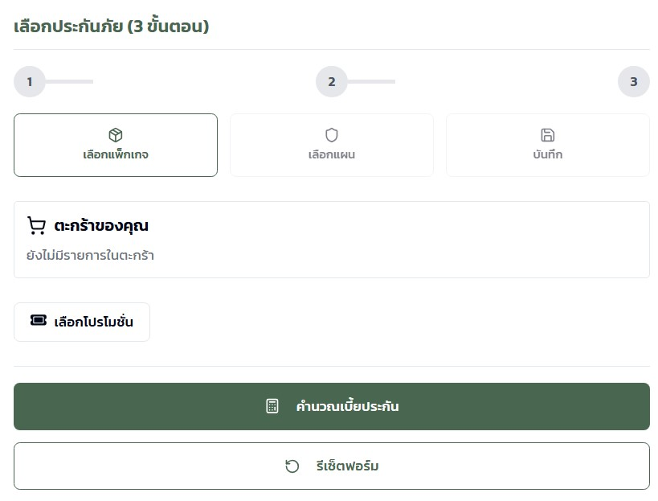
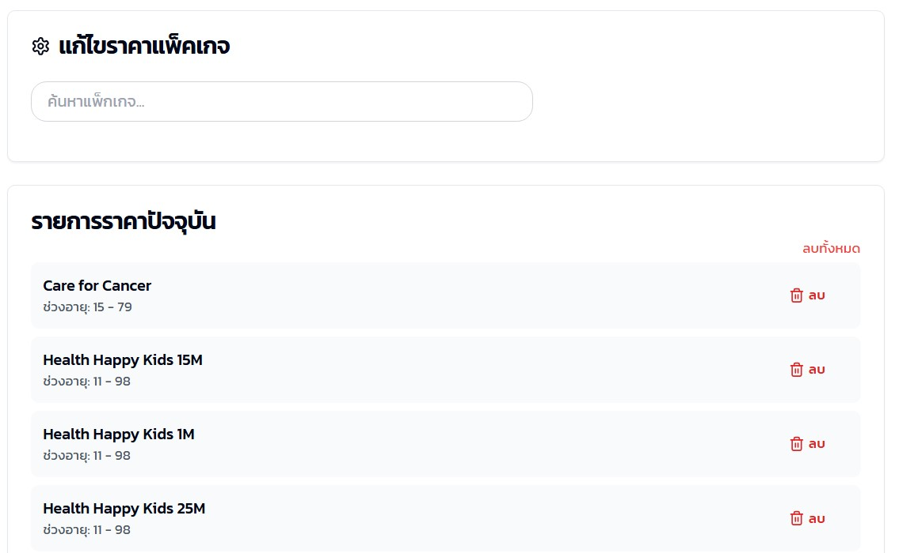
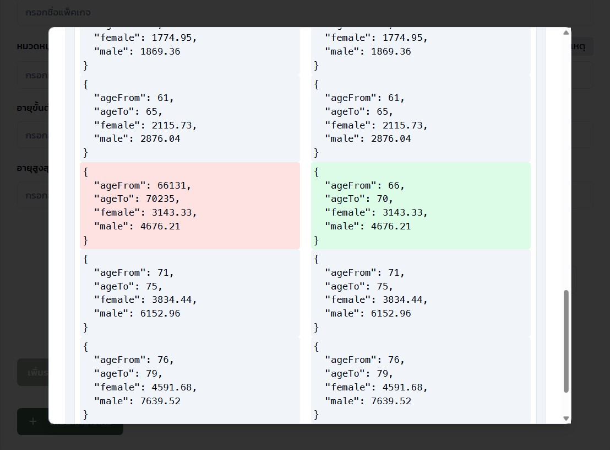
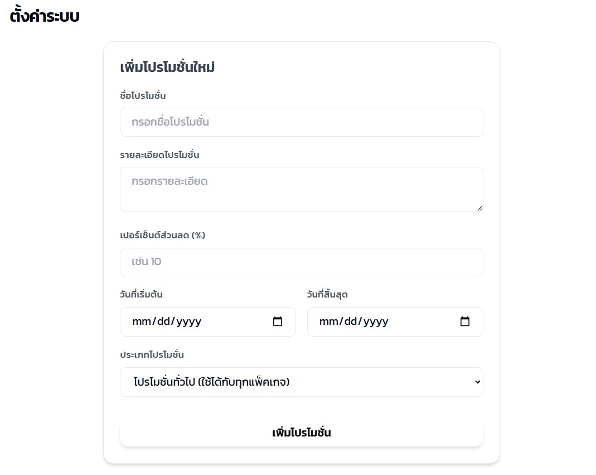
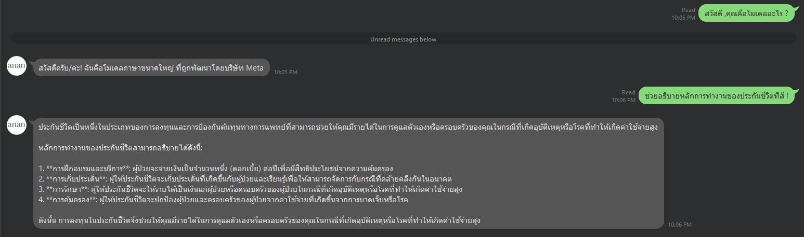

# corestack-platform 🚀

## Table of Contents 📚
- [Installation](#installation)
- [Platform](#platform)
- [Usage Recommendation](#usage-recommendation)
- [Project Structure](#project-structure)
- [Description](#description)
- [Contributing](#contributing)
- [Supporters & Funding](#supporters--funding)
- [Contact](#contact)

---

## Installation ⚙️

### Prerequisites 🧑‍💻
Before starting, make sure you have the following installed:

- **TypeScript**: A superset of JavaScript that adds static types.
- **Python 3.11.x**: Required for backend development.
- **Go language**: For building backend services.
- **MongoDB**: A NoSQL database.
- **NodeJS**: JavaScript runtime for frontend and backend.
- **NGINX**: A web server and reverse proxy.
- **Docker**: Containerization for easier deployment.

### Steps 🔽
1. **Clone the repository**
   ```bash
   git clone https://github.com/triphopMahithi/corestack-platform.git
   ```

2. **Navigate to the project directory**
   ```bash
   cd corestack-platform
   ```

3. **Install dependencies**
   - Python dependencies:
     ```bash
     pip install -r requirements.txt
     ```
   - NodeJS dependencies (Frontend):
     ```bash
     cd ./Apps/frontend
     npm install
     ```

---
# Retrieval-augmented generation (RAG)

## Platform 🌐

### Windows 💻
[Download Windows Version](https://ollama.com/download)

### Linux 🐧
```bash
curl -fsSL https://ollama.com/install.sh | sh
```

### macOS 🍎
[Download macOS Version](https://ollama.com/download)

### Running the RAG Setup

Once you have successfully installed **Ollama** and completed all necessary dependencies, you can proceed to set up the RAG (Retrieval-Augmented Generation) module.

Run the following commands:

```bash
cd ./corestack-platform/Apps/RAG
python setup.py
```
> **⚠️ Important:**  
> For production environments, it is strongly recommended to update and secure the `.env` file with the correct values for your deployment.
Example .env Configuration (rag)
```.env
CHANNEL_SECRET=YOUR_CHANNEL_SECRET
CHANNEL_TOKEN=YOUR_CHANNEL_TOKEN
OLLAMA_URL=http://<YOUR_DOMAIN_OR_LOCALHOST>:11434/api/generate
OLLAMA_MODEL=YOUR_MODEL
MONGO_URI=mongodb://<YOUR_DOMAIN_OR_LOCALHOST>:27017/
MONGO_DB=YOUR_DATABASE
MONGO_DB_COLLECTION=YOUR_COLLECTION
```

---

## Usage Recommendation 🛠️

It is recommended to start the application from the **backend** first, as **Golang** sets the communication port to **PORT: 8080** by default.  
Using a different port may cause issues.

### Steps to Run
1. **Run Backend**
   ```bash
   cd ./Apps/backend
   go run main.go
   ```

2. **Run Frontend**
   ```bash
   cd ./Apps/frontend
   npm run dev
   ```
### How to Update
```bash
cd ./Apps/backend
vim .env
```
Example .env Configuration
```.env
CHANNEL_SECRET=YOUR_CHANNEL_SECRET
CHANNEL_TOKEN=YOUR_CHANNEL_TOKEN
LINE_LOGIN_CHANNEL_SECRET=YOUR_LINE_LOGIN_CHANNEL_SECRET
REDIRECT_URI=<YOUR_DOMAIN_OR_LOCALHOST>/api/auth/callback
OLLAMA_URL=<YOUR_DOMAIN_OR_LOCALHOST>:<PORT_OR_11434>/api/generate
OLLAMA_MODEL=YOUR_MODEL
MONGO_URI=mongodb://<YOUR_DOMAIN_OR_LOCALHOST>:<PORT_OR_27017>/
MONGO_DB=YOUR_DATABASE
MONGO_DB_COLLECTION=YOUR_COLLECTION
USERS_COLLECTION=users
JWT_SECRET=YOUR_JWT_SECRET
JWT_ISSUER=anan-ip
JWT_AUDIENCE=frontend-app
SECRET_KEY=YOUR_SECRET_KEY
FRONTEND_URL=<YOUR_DOMAIN_OR_LOCALHOST>:<PORT_OR_8081>
PORT=8080
```

> **Note:** For more information and detailed documentation, please visit [LINE Developers](https://developers.line.biz/en/).  

### Explanation of Environment Variables

- **CHANNEL_SECRET**  
  The secret key for your LINE Messaging API channel. Used to authenticate your application with the LINE platform.

- **CHANNEL_TOKEN**  
  The access token for your LINE Messaging API channel. Required for sending messages or making API calls to LINE.

- **LINE_LOGIN_CHANNEL_SECRET**  
  The secret key for your LINE Login channel. Used when implementing LINE Login for user authentication.

- **REDIRECT_URI**  
  The callback URL to which LINE will redirect users after successful login.  
  Example:  
  - Production: `https://yourdomain.com/api/auth/callback`  
  - Development: `http://localhost:8080/api/auth/callback`

---

## Project Structure 📁
```text
CORESTACK-PLATFORM
└── Apps
    ├── backend
    │   ├── config
    │   ├── database
    │   ├── handlers
    │   ├── models
    │   ├── services
    │   └── utils
    └── frontend
        └── src
            ├── components
            │   ├── steps
            │   └── ui
            ├── contexts
            ├── hooks
            ├── lib
            ├── pages
            └── utils
```

---

## Description 📝
This project is a **Full-Stack Web Application** integrating **TypeScript**, **Python**, **Go**, **MongoDB**, **NodeJS**, **NGINX**, and **Docker**.  
It streamlines the development process by combining multiple tools into a single platform, making it ideal for building and deploying scalable web applications.

### Preview

<p><strong>Figure 1:</strong> Home Page</p>


<p><strong>Figure 2:</strong> Shopping Cart System</p>


<p><strong>Figure 3:</strong> Product Editing Page</p>


<p><strong>Figure 4:</strong> Issue Inspection Interface</p>


<p><strong>Figure 5:</strong> Admin Dashboard</p>


<p><strong>Figure 6:</strong> (Simple) Retrieval-augmented generation</p>

---

## Contributing 🤝
1. Fork the repository.
2. Create a new branch:
   ```bash
   git checkout -b feature-branch
   ```
3. Commit your changes:
   ```bash
   git commit -am 'Add new feature'
   ```
4. Push to your branch:
   ```bash
   git push origin feature-branch
   ```
5. Create a Pull Request.

---

## Supporters & Funding 💡
**Tranak Nitiwong** - anan.ip

---

## Contact 📬
For questions or support, please contact: **https://www.facebook.com/anan.invest**
